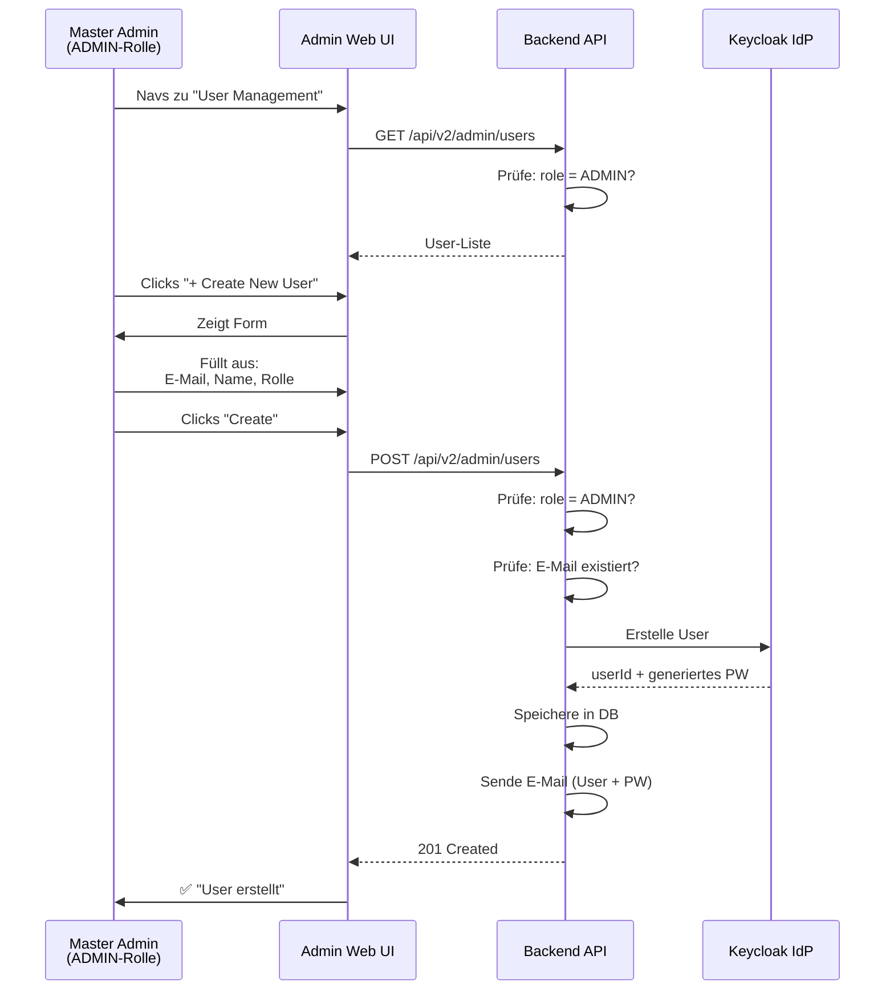

# Admin-Dashboard – Implementierungsdokumentation

**Module:** MS-01 (Auth, vorhanden) + MS-02 (Dashboard, geplant)  
**Framework:** React + TypeScript + Vite  
**State Management:** Zustand  
**HTTP-Client:** Axios  
**Styling:** TailwindCSS  
**Status:** MS-01 ✅ | MS-02 🚀 (in Planung)

---

## Inhaltsverzeichnis

1. [Übersicht](#1-übersicht)
2. [Architektur & Zugriffskontrolle](#2-architektur--zugriffskontrolle)
3. [MS-01: Authentifizierung (✅ Vorhanden)](#3-ms-01-authentifizierung--vorhanden)
4. [MS-02: Admin-Dashboard (🚀 Geplant)](#4-ms-02-admin-dashboard--geplant)
5. [Dateistruktur](#5-dateistruktur)
6. [User Management (Master Admin)](#6-user-management-master-admin)
7. [Komponenten](#7-komponenten)
8. [Services & API](#8-services--api)
9. [State Management](#9-state-management)
10. [Error Handling & Security](#10-error-handling--security)

---

## 1. Übersicht

Das **EcoTrack Admin-Web** ist eine geschlossene Admin-Plattform für Lehrer und Master Admins:

- **Nur authentifizierte Benutzer** dürfen auf das Dashboard zugreifen (Keycloak-Login, MS-01 ✅)
- **Rollen-basierte Zugriffskontrolle (RBAC):**
  - `LEHRER` → Kann eigene Klassen und Schüler verwalten
  - `ADMIN` → Hat Zugriff auf alles + User Management
- **Master Admins legen Accounts an** (nicht Self-Service)
  - Neue Lehrer/Admin-Accounts werden manuell erstellt
  - Temporäres Passwort wird per E-Mail versendet
- **Dashboard zeigt Statistiken** und Verwaltungs-Tools
- **Vollständig responsive** und **barrierefrei** (WCAG)

---

## 2. Architektur & Zugriffskontrolle

### Benutzer-Rollen & Zugriff

```
┌────────────────────────────────────────────────┐
│ Keycloak Authentication (JWT Token)            │
│ Token enthält: userId, email, roles            │
└────────────┬─────────────────────────────────┘
             │
             ▼
        ┌────────────────┐
        │ LoginPage      │
        │ (MS-01 ✅)     │
        │ Keycloak OAuth │
        └────────┬────────┘
                 │
        ┌────────▼──────────────┐
        │ authStore             │
        │ (JWT persistieren)    │
        └────────┬──────────────┘
                 │
                 ▼
        ┌──────────────────────────────────┐
        │ Role-Check                       │
        ├──────────────────────────────────┤
        │ role = ?                         │
        └────────┬──────────────────────────┘
                 │
        ┌────────▼─────────────────────────────────────┐
        │                                              │
    ┌───▼──────┐                              ┌───────▼┐
    │ SCHUELER  │                              │ LEHRER │
    │           │                              │ / ADMIN│
    │ ❌ No     │                              │  ✅ Yes│
    │  Access   │                              │ Access │
    └─────┬─────┘                              └───┬────┘
          │                                        │
          ▼                                        ▼
    ┌─────────────────┐    ┌──────────────────┐────────────────┐
    │ Redirect to     │    │ DashboardPage    │ AdminPage      │
    │ Access Denied   │    │ (Statistics)     │ (nur wenn ADMIN)│
    │ (HTTP 403)      │    │ Classes          │ User Management│
    └─────────────────┘    │ Students         │ System Settings│
                           │ Challenges       │                │
                           └──────────────────┴────────────────┘
```

### Dateistruktur nach Rolle

```
src/
├── pages/
│   ├── LoginPage.tsx              ← Alle können sich einloggen
│   ├── DashboardPage.tsx          ← LEHRER + ADMIN
│   └── AdminManagementPage.tsx    ← Nur ADMIN
│
├── components/
│   ├── common/
│   │   └── ProtectedRoute.tsx     ← Prüft Authentication
│   │
│   ├── ui/
│   │   ├── FormInput.tsx
│   │   ├── Card.tsx
│   │   └── ...
│   │
│   └── features/
│       ├── dashboard/             ← LEHRER + ADMIN
│       │   ├── StatsSummary.tsx
│       │   ├── ClassesList.tsx
│       │   ├── StudentsList.tsx
│       │   └── ChallengesList.tsx
│       │
│       ├── admin/                 ← Nur ADMIN
│       │   ├── UserManagement.tsx
│       │   ├── CreateUserForm.tsx
│       │   ├── UserTable.tsx
│       │   ├── SystemSettings.tsx
│       │   └── Reporting.tsx
│       │
│       └── common/
│           └── Navigation.tsx
│
├── hooks/
│   ├── useAuth.ts                 ← Auth-State
│   ├── useRoleGuard.ts            ← Rolle prüfen
│   └── useUserManagement.ts       ← Admin-Features
│
├── utils/
│   ├── permissions.ts             ← Rollen-Prüfung
│   └── validation.ts
│
└── routes/
    └── index.tsx                  ← Mit RoleGuard
```

---

## 3. MS-01: Authentifizierung (✅ Vorhanden)

### Bereits implementiert:

✅ **LoginPage.tsx**
- Keycloak-Login (OAuth2 / OpenID Connect)
- Email + Passwort
- "Passwort vergessen" Link
- Passwortänderungs-Zwang (Update_Password Action)

✅ **authStore.ts** (Zustand)
- Session-Management
- JWT Token Storage (sessionStorage)
- Login / Logout
- Automatisches Refresh

✅ **authApi.ts**
- `POST /api/v1/auth/admin/login`
- `POST /api/v1/auth/logout`
- `POST /api/v1/auth/password/change`
- `GET /api/v1/users/me`

✅ **ProtectedRoute.tsx**
- Authentifizierungs-Check
- Automatisches Redirect zu Login

✅ **DashboardPage.tsx** (Platzhalter)
- Nach Login angezeigt
- Volle Implementation in MS-02

---

## 4. MS-02: Admin-Dashboard (🚀 Geplant)

Das Admin-Dashboard wird in einem späteren Meilenstein implementiert. Folgende Features sind geplant:

### 4.1 Dashboard-Übersicht (LEHRER + ADMIN)

**Komponenten:**
- **StatsSummary:** Boxen mit Key-Metriken
  - Anzahl Klassen
  - Anzahl Schüler
  - Aktive Challenges
  - CO2 gespart (diese Woche)
  
- **ClassesList:** Tabelle mit Klassen
  - Klasse (z.B. 5AHIT)
  - Anzahl Schüler
  - Durchschnittliche Punkte
  - Actions (Bearbeiten, Schüler anzeigen)

- **StudentsList:** Schüler filtern/suchen
  - Nach Klasse filtern
  - Schüler-Name, E-Mail
  - Punkte gesamt
  - Letzte Aktion

- **ChallengesList:** Aktuelle Challenges
  - Challenge-Name
  - Enddatum
  - Beteiligungsquote
  - Link zur Challenge

### 4.2 Klassenverwaltung (LEHRER + ADMIN)

**Funktionen:**
- Neue Klasse erstellen
- Klasse bearbeiten (Name, etc.)
- Schüler zu Klasse hinzufügen
- Schüler aus Klasse entfernen

**API-Endpunkte (zukünftig):**
```
GET    /api/v2/classes              → Alle Klassen (gefiltert nach Lehrer)
POST   /api/v2/classes              → Neue Klasse anlegen
PUT    /api/v2/classes/{id}         → Klasse bearbeiten
DELETE /api/v2/classes/{id}         → Klasse löschen
```

### 4.3 User Management (nur ADMIN)

**Funktionen:**
- Alle Benutzer auflisten
- Neue Lehrer/Admin-Accounts anlegen
- Rolle ändern
- Accounts deaktivieren
- Admin-Aktivitäts-Log

**UI:**
```
┌───────────────────────────────────────┐
│ User Management (Admin Only)          │
├───────────────────────────────────────┤
│                                       │
│ [+ Create New User]                   │
│                                       │
│ Filter: [All / Active / Inactive] ▼   │
│                                       │
│ ┌────────────────────────────────┐   │
│ │ Email      │ Name    │ Role    │   │
│ ├────────────────────────────────┤   │
│ │ teacher@.. │ Max M.  │ LEHRER  │   │
│ │ admin@..   │ Admin A.│ ADMIN   │   │
│ │ ...        │ ...     │ ...     │   │
│ └────────────────────────────────┘   │
│                                       │
└───────────────────────────────────────┘
```

**API-Endpunkte (zukünftig):**
```
GET    /api/v2/admin/users              → Alle User (nur Admin)
POST   /api/v2/admin/users              → Neue User anlegen
PUT    /api/v2/admin/users/{id}/role    → Rolle ändern
POST   /api/v2/admin/users/{id}/deactivate → User deaktivieren
GET    /api/v2/admin/audit-log          → Aktivitäts-Log
```

---

## 5. Dateistruktur

### Vorhanden (MS-01):

```
✅ src/pages/
   ├── LoginPage.tsx
   └── DashboardPage.tsx (Platzhalter)

✅ src/stores/
   └── authStore.ts

✅ src/services/
   ├── authApi.ts
   └── authMockApi.ts

✅ src/types/
   └── auth.ts

✅ src/components/
   └── common/
       └── ProtectedRoute.tsx

✅ src/routes/
   └── index.tsx
```

### Geplant (MS-02):

```
🚀 src/pages/
   └── AdminManagementPage.tsx    ← Neue Seite für Admin

🚀 src/components/features/
   ├── dashboard/                 ← Dashboard-Komponenten
   │   ├── StatsSummary.tsx
   │   ├── ClassesList.tsx
   │   ├── StudentsList.tsx
   │   └── ChallengesList.tsx
   │
   └── admin/                     ← Admin-Komponenten
       ├── UserManagement.tsx
       ├── CreateUserForm.tsx
       ├── UserTable.tsx
       ├── EditUserForm.tsx
       └── RoleAssignment.tsx

🚀 src/services/
   ├── classApi.ts               ← Klassen-API
   ├── studentApi.ts             ← Schüler-API
   ├── challengeApi.ts           ← Challenges-API
   └── userManagementApi.ts      ← Admin User-API

🚀 src/stores/
   ├── dashboardStore.ts         ← Dashboard State
   ├── classStore.ts             ← Klassen State
   └── userManagementStore.ts    ← Admin User State

🚀 src/hooks/
   ├── useDashboard.ts           ← Dashboard Hook
   ├── useClasses.ts             ← Klassen Hook
   ├── useRoleGuard.ts           ← Rollen-Prüfung Hook
   └── useUserManagement.ts      ← Admin User Hook

🚀 src/utils/
   └── permissions.ts            ← Berechtigungs-Check
```

---

## 6. User Management (Master Admin)

### Create User Flow



**Request (Master Admin):**
```json
{
  "email": "neuelehrer@lehrer.htl-leoben.at",
  "firstName": "Neue",
  "lastName": "Lehrer",
  "role": "LEHRER"
}
```

**Response (201 Created):**
```json
{
  "userId": "abc-123-def",
  "email": "neuelehrer@lehrer.htl-leoben.at",
  "role": "LEHRER",
  "message": "Account erfolgreich erstellt. Temporäres Passwort über E-Mail versendet."
}
```

**Fehler-Antworten:**

| HTTP | Code | Beschreibung |
|------|------|-------------|
| 401 | `UNAUTHORIZED` | User nicht authentifiziert |
| 403 | `FORBIDDEN` | User hat keine ADMIN-Rolle |
| 400 | `EMAIL_EXISTS` | E-Mail bereits registriert |
| 400 | `INVALID_DOMAIN` | E-Mail-Domain nicht erlaubt |
| 422 | – | Validierungsfehler |

---

## 7. Komponenten

### DashboardPage.tsx (MS-02 geplant)

```typescript
/**
 * DashboardPage — Übersichtsseite für Lehrer & Admins
 *
 * Zeigt:
 * - Statistiken
 * - Klassen Liste
 * - Schüler Liste
 * - Challenges
 * - [Admin nur] Admin Panel Link
 */

import { useRoleGuard } from '@/hooks/useRoleGuard';
import { useAuthStore } from '@/stores/authStore';
import { StatsSummary } from '@/components/features/dashboard/StatsSummary';
import { ClassesList } from '@/components/features/dashboard/ClassesList';
import { StudentsList } from '@/components/features/dashboard/StudentsList';
import { Navigation } from '@/components/features/common/Navigation';

export function DashboardPage() {
  const user = useAuthStore((s) => s.session?.user);

  // Redirect wenn nicht LEHRER/ADMIN
  useRoleGuard('LEHRER', 'ADMIN');

  return (
    <div className="min-h-screen bg-gray-50">
      <Navigation />

      <main className="max-w-7xl mx-auto px-6 py-8 space-y-6">
        {/* Header */}
        <div>
          <h1 className="text-3xl font-bold text-gray-900">
            Willkommen, {user?.firstName}!
          </h1>
          <p className="text-gray-600">Übersicht der Klassen und Aktivitäten</p>
        </div>

        {/* Stats Summary */}
        <StatsSummary />

        {/* Classes & Students */}
        <div className="grid grid-cols-1 lg:grid-cols-2 gap-6">
          <ClassesList />
          <StudentsList />
        </div>
      </main>
    </div>
  );
}
```

### AdminManagementPage.tsx (MS-02 geplant)

```typescript
/**
 * AdminManagementPage — Nutzer-Verwaltung (nur ADMIN)
 *
 * Features:
 * - CreateUserForm
 * - UserTable
 * - Role Assignment
 * - Activity Log
 */

import { useRoleGuard } from '@/hooks/useRoleGuard';
import { CreateUserForm } from '@/components/features/admin/CreateUserForm';
import { UserTable } from '@/components/features/admin/UserTable';
import { useUserManagement } from '@/hooks/useUserManagement';
import { useState } from 'react';

export function AdminManagementPage() {
  const { users, loading, error, createUser, refreshUsers } = useUserManagement();
  const [showForm, setShowForm] = useState(false);

  // Nur ADMIN darf diese Seite sehen
  useRoleGuard('ADMIN');

  return (
    <div className="min-h-screen bg-gray-50">
      <div className="max-w-7xl mx-auto px-6 py-8 space-y-6">
        <div className="flex justify-between items-center">
          <h1 className="text-3xl font-bold">Benutzer-Verwaltung</h1>
          <button
            onClick={() => setShowForm(!showForm)}
            className="px-4 py-2 bg-primary-600 text-white rounded-lg hover:bg-primary-700"
          >
            {showForm ? 'Abbrechen' : '+ Neuer Benutzer'}
          </button>
        </div>

        {showForm && (
          <CreateUserForm
            onSuccess={() => {
              setShowForm(false);
              refreshUsers();
            }}
          />
        )}

        {error && (
          <div className="bg-red-50 text-red-700 p-4 rounded border border-red-200">
            {error}
          </div>
        )}

        {loading ? (
          <div className="text-center py-8">Wird geladen...</div>
        ) : (
          <UserTable users={users} onRefresh={refreshUsers} />
        )}
      </div>
    </div>
  );
}
```

---

## 8. Services & API

### userManagementApi.ts (geplant für MS-02)

```typescript
/**
 * User Management API
 *
 * Nur Endpunkte mit @PreAuthorize("hasRole('ADMIN')")
 */

import apiClient from '@/api/apiClient';
import type { AdminUser, CreateUserRequest, CreateUserResponse } from '@/types/admin';

// Alle User auflisten (Master Admin only)
export async function listAllUsers(): Promise<AdminUser[]> {
  const { data } = await apiClient.get<AdminUser[]>('/api/v2/admin/users');
  return data;
}

// Neuen User anlegen
export async function createUser(
  request: CreateUserRequest
): Promise<CreateUserResponse> {
  const { data } = await apiClient.post<CreateUserResponse>(
    '/api/v2/admin/users',
    request
  );
  return data;
}

// Rolle ändern
export async function updateUserRole(userId: string, role: string): Promise<void> {
  await apiClient.put(`/api/v2/admin/users/${userId}/role`, { role });
}

// User deaktivieren
export async function deactivateUser(userId: string): Promise<void> {
  await apiClient.post(`/api/v2/admin/users/${userId}/deactivate`);
}
```

---

## 9. State Management

### useRoleGuard Hook (geplant)

```typescript
/**
 * Prüft ob User die benötigte Rolle hat
 * Redirect wenn nicht authentifiziert oder Rolle zu niedrig
 */

import { useAuthStore, isAuthenticated } from '@/stores/authStore';
import { useNavigate } from 'react-router-dom';
import { useEffect } from 'react';

export function useRoleGuard(...requiredRoles: string[]) {
  const navigate = useNavigate();
  const session = useAuthStore((state) => state.session);
  const authenticated = useAuthStore(isAuthenticated);

  useEffect(() => {
    if (!authenticated) {
      navigate('/login', { replace: true });
      return;
    }

    if (!session || !requiredRoles.includes(session.user.role)) {
      navigate('/dashboard', { replace: true });
      return;
    }
  }, [authenticated, session, navigate, requiredRoles]);
}

// Verwendung:
// useRoleGuard('ADMIN');  → Nur ADMIN
// useRoleGuard('LEHRER', 'ADMIN');  → LEHRER oder ADMIN
```

### permissions.ts Utils (geplant)

```typescript
/**
 * Utility-Funktionen für Berechtigungsprüfung
 */

export function canManageUsers(role?: string): boolean {
  return role === 'ADMIN';
}

export function canViewAdminPanel(role?: string): boolean {
  return role === 'ADMIN';
}

export function canManageClasses(role?: string): boolean {
  return role === 'LEHRER' || role === 'ADMIN';
}

export function canEditClass(role?: string, classOwnerId?: string, userId?: string): boolean {
  if (role === 'ADMIN') return true;
  if (role === 'LEHRER') return classOwnerId === userId;
  return false;
}
```

---

## 10. Error Handling & Security

### Frontend Security

1. **Role Guards in Routes:**
   ```typescript
   // Nur ADMIN darf auf /admin/users zugreifen
   <Route 
     path="/admin/users" 
     element={<RoleGuard role="ADMIN"><AdminManagementPage /></RoleGuard>} 
   />
   ```

2. **API Error Handling:**
   - `401 UNAUTHORIZED` → Redirect zu /login
   - `403 FORBIDDEN` → Zeige "Keine Berechtigung" + Redirect zu /dashboard
   - `400/422` → Zeige Formfehler

3. **Token Handling:**
   - JWT automatisch via Axios-Interceptor
   - Token-Refresh bei Bedarf
   - Token-Expiry-Prüfung

### Backend Security (WICHTIG!)

Das Backend MUSS folgende Checks implementieren:

1. **Authentifizierung:**
   ```java
   @GetMapping("/api/v2/admin/users")
   @PreAuthorize("isAuthenticated()")  // JWT
   public List<AdminUser> listUsers() { ... }
   ```

2. **Autorisierung (vor JEDEM Admin-Endpunkt):**
   ```java
   @PostMapping("/api/v2/admin/users")
   @PreAuthorize("hasRole('ADMIN')")  // Nur ADMIN!
   public CreateUserResponse createUser(@RequestBody CreateUserRequest req) {
     // Falls role != ADMIN → 403 Forbidden
     // Keine Exception, kein Stack Trace!
   }
   ```

3. **Input-Validierung:**
   - E-Mail-Format wirklich gültig?
   - Domain in Whitelist enthalten?
   - Rolle gültig (LEHRER / ADMIN)?
   - Keine SQL-Injection, XSS, etc.

4. **Audit-Logging:**
   ```java
   // Protokolliere: Wer hat was wann geändert?
   auditLog.info("User {} created account for {}", adminEmail, newUserEmail);
   ```

---

## Implementierungs-Roadmap

### ✅ MS-01 (Vorhanden):
- [x] Keycloak-Login
- [x] Auth-Store & Token-Management
- [x] Protected Routes
- [x] DashboardPage (Platzhalter)

### 🚀 MS-02 (Geplant):
- [ ] Dashboard-Komponenten (Stats, Klassen, Schüler)
- [ ] Klassenverwaltung (Create, Edit, Delete)
- [ ] Schülerverwaltung
- [ ] AdminManagementPage (nur ADMIN)
- [ ] useRoleGuard Hook
- [ ] permissions.ts Utils
- [ ] userManagementApi.ts
- [ ] CreateUserForm Komponente
- [ ] UserTable Komponente
- [ ] Error Handling & Feedback
- [ ] Tests schreiben
- [ ] Backend API implementieren (@PreAuthorize)
- [ ] Security-Review
- [ ] Production Deployment

---

## Referenzen

- **Auth-Dokumentation:** `_server/docs/KEYCLOAK_AUTH_IMPLEMENTATION.md`
- **Self-Registration-Dokumentation:** `_server/docs/SELF_REGISTRATION_IMPLEMENTATION.md`
- **Backend-Implementation:** `_server/docs/BACKEND_IMPLEMENTATION_DOCUMENTATION.md`
- **Design-System:** TailwindCSS + Komponenten in `/src/components/ui`
- **State Management:** [Zustand Dokumentation](https://github.com/pmndrs/zustand)
