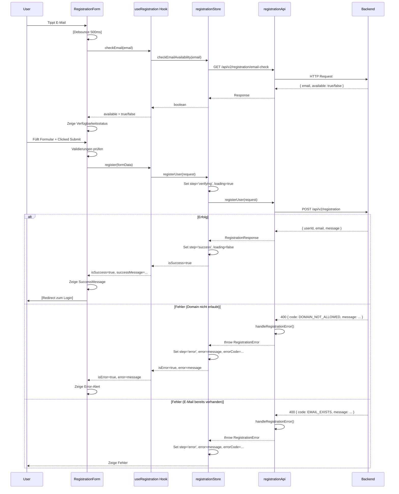

# Self-Registration – Admin-Web Implementierungsdokumentation

**User Story:** US-USR-02-REF  
**Framework:** React + TypeScript + Vite  
**HTTP-Client:** Axios  
**Styling:** TailwindCSS  
**Status:** Implementiert ✅

---

## Inhaltsverzeichnis

1. [Übersicht](#1-übersicht)
2. [Architektur](#2-architektur)
3. [Dateistruktur](#3-dateistruktur)
4. [Komponenten](#4-komponenten)
5. [Services & API](#5-services--api)
6. [State Management](#6-state-management)
7. [Registrierungsfluss](#7-registrierungsfluss)
8. [Fehlerbehandlung](#8-fehlerbehandlung)
9. [Validierung](#9-validierung)
10. [Testing-Strategie](#10-testing-strategie)
11. [Integration mit Backend](#11-integration-mit-backend)

---

## 1. Übersicht

Die Self-Registration im Admin-Web ermöglicht es Schüler:innen und Lehrer:innen, sich selbständig zu registrieren. Die Implementierung:

- Bietet ein benutzerfreundliches **Registrierungsformular** mit Real-Time-Validierung
- Prüft die **E-Mail-Verfügbarkeit** während der Eingabe (ohne zu speichern)
- Verwaltet den **Registrierungsprozess** von Anfang bis Bestätigung
- Bietet klare **Fehlermeldungen** und **Success-Feedback**
- Ist vollständig **responsive** und **barrierefrei** (WCAG)
- Nutzt die bestehende **Auth-Infrastruktur** für Login-Umleitung

---

## 2. Architektur

```
src/
├── pages/
│   ├── LoginPage.tsx          (bestehend)
│   └── RegistrationPage.tsx   (neu) ← Einstiegspunkt
│
├── components/
│   └── features/
│       ├── registration/
│       │   ├── RegistrationForm.tsx         ← Hauptformular
│       │   ├── EmailVerificationStep.tsx    ← E-Mail-Verifikation nach Registrierung
│       │   ├── ValidationMessage.tsx        ← Inline-Validierungsmeldungen
│       │   └── SuccessMessage.tsx           ← Erfolgreiche Registrierung
│       │
│       └── common/
│           └── FormInput.tsx                ← Wiederverwendbares Input-Feld
│
├── services/
│   ├── authApi.ts             (bestehend, erweitert)
│   ├── authMockApi.ts         (bestehend, erweitert)
│   └── registrationApi.ts     (neu) ← Registration-Endpunkte
│
├── stores/
│   ├── authStore.ts           (bestehend, erweitert)
│   └── registrationStore.ts   (neu) ← Registration-State
│
├── types/
│   ├── auth.ts                (bestehend, erweitert)
│   └── registration.ts        (neu) ← Registration-Typen
│
├── hooks/
│   └── useRegistration.ts     (neu) ← Custom Hook für Registrierung
│
├── utils/
│   └── validation.ts          (neu) ← Validierungshelfer
│
└── routes/
    └── index.tsx              (angepasst) ← Route hinzufügen
```

### Schichtprinzip (Clean Architecture)

| Schicht | Datei | Aufgabe |
|---------|-------|---------|
| **Seite** | `RegistrationPage.tsx` | Routing & Layout |
| **Komponenten** | `RegistrationForm.tsx`, etc. | UI-Logik & Rendering |
| **Custom Hooks** | `useRegistration.ts` | Business-Logik |
| **Store** | `registrationStore.ts` | Globaler State |
| **Services** | `registrationApi.ts` | HTTP-Kommunikation |
| **Utils** | `validation.ts` | Wiederverwendbare Funktionen |
| **Types** | `registration.ts` | TypeScript-Definitionen |

---

## 3. Dateistruktur & Templates

### 3.1 Types (`src/types/registration.ts`)

```typescript
/**
 * Registrierungs-Typen
 */

/** Request-Payload für POST /api/v2/registration */
export interface RegistrationRequest {
  email: string;
  password: string;
  firstName: string;
  lastName: string;
  classId?: string;
}

/** Erfolgreiche Registrierungs-Response */
export interface RegistrationResponse {
  userId: string;
  email: string;
  message: string;
}

/** Request-Payload für GET /api/v2/registration/email-check */
export interface EmailCheckRequest {
  email: string;
}

/** E-Mail-Verfügbarkeits-Response */
export interface EmailAvailabilityResponse {
  email: string;
  available: boolean;
}

/** Registrierungs-State */
export interface RegistrationState {
  step: 'form' | 'verifying' | 'success' | 'error';
  email: string | null;
  userId: string | null;
  loading: boolean;
  error: string | null;
  successMessage: string | null;
}

/** Validierungsergebnis */
export interface ValidationError {
  field: string;
  message: string;
}

/** Form-Validierungszustand */
export interface FormValidation {
  isValid: boolean;
  errors: Record<string, string>;
}
```

---

### 3.2 Validierungshilfen (`src/utils/validation.ts`)

```typescript
/**
 * Validierungshilfen für Registrierungsformular
 */

export interface ValidationRules {
  email: {
    required: boolean;
    minLength?: number;
    maxLength?: number;
    pattern?: RegExp;
  };
  password: {
    required: boolean;
    minLength: number;
    maxLength?: number;
    requireUppercase: boolean;
    requireNumbers: boolean;
    requireSpecialChars: boolean;
  };
  firstName: {
    required: boolean;
    minLength: number;
    maxLength: number;
  };
  lastName: {
    required: boolean;
    minLength: number;
    maxLength: number;
  };
}

// Standard-Validierungsregeln
export const REGISTRATION_RULES: ValidationRules = {
  email: {
    required: true,
    pattern: /^[^\s@]+@[^\s@]+\.[^\s@]+$/,
  },
  password: {
    required: true,
    minLength: 8,
    maxLength: 128,
    requireUppercase: false,  // Kann später erweitert werden
    requireNumbers: false,
    requireSpecialChars: false,
  },
  firstName: {
    required: true,
    minLength: 2,
    maxLength: 50,
  },
  lastName: {
    required: true,
    minLength: 2,
    maxLength: 50,
  },
};

/** Validiert einzelnes Feld */
export function validateField(
  fieldName: string,
  value: string,
  rules: ValidationRules
): string | null {
  if (!rules[fieldName as keyof ValidationRules]) {
    return null;
  }

  const fieldRules = rules[fieldName as keyof ValidationRules] as any;

  if (fieldRules.required && !value?.trim()) {
    return `${fieldName} ist erforderlich.`;
  }

  if (fieldRules.minLength && value.length < fieldRules.minLength) {
    return `${fieldName} muss mindestens ${fieldRules.minLength} Zeichen lang sein.`;
  }

  if (fieldRules.maxLength && value.length > fieldRules.maxLength) {
    return `${fieldName} darf maximal ${fieldRules.maxLength} Zeichen lang sein.`;
  }

  if (fieldRules.pattern && !fieldRules.pattern.test(value)) {
    return `${fieldName} hat ein ungültiges Format.`;
  }

  return null;
}

/** Validiert das gesamte Formular */
export function validateForm(
  formData: Record<string, string>,
  rules: ValidationRules
): FormValidation {
  const errors: Record<string, string> = {};

  Object.keys(rules).forEach((fieldName) => {
    const error = validateField(fieldName, formData[fieldName], rules);
    if (error) {
      errors[fieldName] = error;
    }
  });

  return {
    isValid: Object.keys(errors).length === 0,
    errors,
  };
}

/** Prüft Passwort-Stärke (für zukünftige Erweiterung) */
export function getPasswordStrength(password: string): 'weak' | 'medium' | 'strong' {
  let strength = 0;
  if (/[a-z]/.test(password)) strength++;
  if (/[A-Z]/.test(password)) strength++;
  if (/[0-9]/.test(password)) strength++;
  if (/[^a-zA-Z0-9]/.test(password)) strength++;
  
  if (password.length >= 12) strength++;
  
  if (strength <= 2) return 'weak';
  if (strength <= 3) return 'medium';
  return 'strong';
}
```

---

### 3.3 API-Service (`src/services/registrationApi.ts`)

```typescript
/**
 * Registration-API-Service
 *
 * Endpunkte:
 * - POST /api/v2/registration
 * - GET  /api/v2/registration/email-check
 */

import apiClient from '@/api/apiClient';
import type {
  RegistrationRequest,
  RegistrationResponse,
  EmailAvailabilityResponse,
} from '@/types/registration';
import { AxiosError } from 'axios';

/** Registrierungsfehler-Codes */
export enum RegistrationErrorCode {
  DOMAIN_NOT_ALLOWED = 'DOMAIN_NOT_ALLOWED',
  EMAIL_EXISTS = 'EMAIL_EXISTS',
  INVALID_REQUEST = 'INVALID_REQUEST',
  SERVER_ERROR = 'SERVER_ERROR',
}

export class RegistrationError extends Error {
  constructor(
    public code: RegistrationErrorCode,
    message: string,
    public status: number
  ) {
    super(message);
    this.name = 'RegistrationError';
  }
}

/** Fehlerbehandlung */
function handleRegistrationError(error: unknown): never {
  if (error instanceof AxiosError && error.response?.data) {
    const body = error.response.data as any;
    
    const code = (body.code || 'SERVER_ERROR') as RegistrationErrorCode;
    const message = body.message || 'Registrierung fehlgeschlagen.';
    const status = error.response.status;

    throw new RegistrationError(code, message, status);
  }

  if (error instanceof AxiosError && !error.response) {
    throw new RegistrationError(
      RegistrationErrorCode.SERVER_ERROR,
      'Backend nicht erreichbar.',
      0
    );
  }

  throw error;
}

/**
 * POST /api/v2/registration
 *
 * @throws {RegistrationError} wenn E-Mail-Domain nicht erlaubt oder bereits registriert
 */
export async function registerUser(
  request: RegistrationRequest
): Promise<RegistrationResponse> {
  try {
    const { data } = await apiClient.post<RegistrationResponse>(
      '/api/v2/registration',
      request
    );
    return data;
  } catch (error) {
    handleRegistrationError(error);
  }
}

/**
 * GET /api/v2/registration/email-check?email=...
 *
 * Prüft, ob eine E-Mail-Adresse verfügbar ist (ohne zu speichern).
 * Nützlich für Real-Time-Validierung beim Typing.
 *
 * @param email - E-Mail-Adresse zu prüfen
 * @returns true wenn E-Mail verfügbar, false wenn bereits registriert
 */
export async function checkEmailAvailability(
  email: string
): Promise<EmailAvailabilityResponse> {
  try {
    const { data } = await apiClient.get<EmailAvailabilityResponse>(
      '/api/v2/registration/email-check',
      { params: { email } }
    );
    return data;
  } catch (error) {
    // Bei Fehler (z.B. 422 Validation Error) wird E-Mail als nicht verfügbar behandelt
    if (error instanceof AxiosError && error.response?.status === 422) {
      return { email, available: false };
    }
    handleRegistrationError(error);
  }
}
```

---

### 3.4 Mock-API (`src/services/authMockApi.ts` – Erweiterung)

```typescript
/**
 * Mock-API Extension für Registration
 * (Ergänzung zur bestehenden authMockApi.ts)
 */

import type {
  RegistrationRequest,
  RegistrationResponse,
  EmailAvailabilityResponse,
} from '@/types/registration';

// Simulierte bereits registrierte E-Mails
const registeredEmails = new Set([
  'max.mustermann@schueler.htl-leoben.at',
  'anna.mueller@lehrer.htl-leoben.at',
]);

// Simulierte nicht erlaubte Domains
const forbiddenDomains = ['gmail.com', 'hotmail.at', 'example.com'];

export async function mockRegisterUser(
  request: RegistrationRequest
): Promise<RegistrationResponse> {
  // Simuliere Verzögerung
  await new Promise((resolve) => setTimeout(resolve, 1500));

  const { email } = request;

  // Prüfe Domain
  const domain = email.split('@')[1];
  if (forbiddenDomains.includes(domain)) {
    const err = new Error('Diese E-Mail-Domain ist nicht für die Registrierung zugelassen.');
    (err as any).code = 'DOMAIN_NOT_ALLOWED';
    (err as any).status = 400;
    throw err;
  }

  // Prüfe ob E-Mail bereits registriert
  if (registeredEmails.has(email)) {
    const err = new Error('Diese E-Mail-Adresse ist bereits registriert.');
    (err as any).code = 'EMAIL_EXISTS';
    (err as any).status = 400;
    throw err;
  }

  // Erfolgreiche Registrierung
  const userId = `user-${Date.now()}`;
  registeredEmails.add(email);

  return {
    userId,
    email,
    message: 'Registrierung erfolgreich. Bitte prüfe dein E-Mail-Postfach und bestätige deine Adresse.',
  };
}

export async function mockCheckEmailAvailability(
  email: string
): Promise<EmailAvailabilityResponse> {
  // Simuliere Verzögerung
  await new Promise((resolve) => setTimeout(resolve, 300));

  return {
    email,
    available: !registeredEmails.has(email),
  };
}
```

---

### 3.5 Store (`src/stores/registrationStore.ts`)

```typescript
/**
 * Registration-Store (Zustand)
 *
 * Verwaltet:
 * - Registrierungsformular-State
 * - Validierungsfehler
 * - API-Ladezustand
 * - Erfolgs-/Fehlermeldungen
 */

import * as coreApi from '@/services/registrationApi';
import * as mockApi from '@/services/authMockApi';
import type {
  RegistrationRequest,
  RegistrationResponse,
} from '@/types/registration';
import { create } from 'zustand';

const useMock = import.meta.env.VITE_USE_MOCK_API === 'true';

export type RegistrationStep = 'form' | 'verifying' | 'success' | 'error';

interface RegistrationState {
  // State
  step: RegistrationStep;
  email: string | null;
  userId: string | null;
  loading: boolean;
  error: string | null;
  errorCode: string | null;
  successMessage: string | null;

  // Aktionen
  registerUser: (request: RegistrationRequest) => Promise<void>;
  checkEmailAvailability: (email: string) => Promise<boolean>;
  reset: () => void;
  resetError: () => void;
}

export const useRegistrationStore = create<RegistrationState>((set, get) => ({
  // Initial State
  step: 'form',
  email: null,
  userId: null,
  loading: false,
  error: null,
  errorCode: null,
  successMessage: null,

  // Register User
  registerUser: async (request: RegistrationRequest) => {
    set({
      step: 'verifying',
      loading: true,
      error: null,
      errorCode: null,
      successMessage: null,
    });

    try {
      const api = useMock ? mockApi : coreApi;
      const response = await (useMock
        ? mockApi.mockRegisterUser(request)
        : coreApi.registerUser(request));

      const typed = response as RegistrationResponse;

      set({
        step: 'success',
        loading: false,
        email: typed.email,
        userId: typed.userId,
        successMessage: typed.message,
      });
    } catch (err) {
      const message =
        err instanceof Error ? err.message : 'Registrierung fehlgeschlagen.';
      const code = (err as any)?.code || 'UNKNOWN_ERROR';

      set({
        step: 'error',
        loading: false,
        error: message,
        errorCode: code,
      });
    }
  },

  // Check Email Availability
  checkEmailAvailability: async (email: string): Promise<boolean> => {
    try {
      const result = useMock
        ? await mockApi.mockCheckEmailAvailability(email)
        : await coreApi.checkEmailAvailability(email);
      return result.available;
    } catch {
      // Bei Fehler: konservativ "nicht verfügbar" zurückgeben
      return false;
    }
  },

  // Reset
  reset: () =>
    set({
      step: 'form',
      email: null,
      userId: null,
      loading: false,
      error: null,
      errorCode: null,
      successMessage: null,
    }),

  resetError: () =>
    set({
      error: null,
      errorCode: null,
      step: 'form',
    }),
}));
```

---

### 3.6 Custom Hook (`src/hooks/useRegistration.ts`)

```typescript
/**
 * Custom Hook für Registrierungs-Business-Logic
 *
 * Macht den Store einfacher zu nutzen und testbar.
 */

import { useRegistrationStore } from '@/stores/registrationStore';
import type { RegistrationRequest } from '@/types/registration';
import { validateForm, REGISTRATION_RULES, validateField } from '@/utils/validation';
import { useCallback, useState } from 'react';

interface UseRegistrationReturn {
  // State
  isLoading: boolean;
  isSuccess: boolean;
  isError: boolean;
  error: string | null;
  successMessage: string | null;
  email: string | null;
  userId: string | null;

  // Aktionen
  register: (formData: RegistrationRequest) => Promise<void>;
  checkEmail: (email: string) => Promise<boolean>;
  validateField: (fieldName: string, value: string) => string | null;
  validateForm: (formData: Record<string, string>) => ReturnType<typeof validateForm>;
  reset: () => void;
}

export function useRegistration(): UseRegistrationReturn {
  const store = useRegistrationStore();
  const [emailCheckLoading, setEmailCheckLoading] = useState(false);

  const register = useCallback(
    async (formData: RegistrationRequest) => {
      await store.registerUser(formData);
    },
    [store]
  );

  const checkEmail = useCallback(
    async (email: string): Promise<boolean> => {
      setEmailCheckLoading(true);
      try {
        return await store.checkEmailAvailability(email);
      } finally {
        setEmailCheckLoading(false);
      }
    },
    [store]
  );

  const validateSingleField = useCallback((fieldName: string, value: string) => {
    return validateField(fieldName, value, REGISTRATION_RULES);
  }, []);

  const validateAllFields = useCallback((formData: Record<string, string>) => {
    return validateForm(formData, REGISTRATION_RULES);
  }, []);

  return {
    isLoading: store.loading || emailCheckLoading,
    isSuccess: store.step === 'success',
    isError: store.step === 'error',
    error: store.error,
    successMessage: store.successMessage,
    email: store.email,
    userId: store.userId,

    register,
    checkEmail,
    validateField: validateSingleField,
    validateForm: validateAllFields,
    reset: store.reset,
  };
}
```

---

## 4. Komponenten

### 4.1 RegistrationForm.tsx

```typescript
/**
 * RegistrationForm — Hauptformular
 *
 * Feature:
 * - Formular-State (email, password, firstName, lastName, classId)
 * - Live-Validierung bei Blur
 * - E-Mail-Verfügbarkeitsprüfung (mit Debounce)
 * - Loading-States
 * - Inline-Fehler pro Feld
 * - Accessible (WCAG)
 */

import { useRegistration } from '@/hooks/useRegistration';
import { useCallback, useEffect, useState } from 'react';
import FormInput from '@/components/ui/FormInput';
import ValidationMessage from './ValidationMessage';
import SuccessMessage from './SuccessMessage';

interface RegistrationFormProps {
  onSuccess?: () => void;
}

export function RegistrationForm({ onSuccess }: RegistrationFormProps) {
  const {
    isLoading,
    isSuccess,
    isError,
    error,
    successMessage,
    register,
    checkEmail,
    validateField,
    validateForm,
    reset,
  } = useRegistration();

  const [formData, setFormData] = useState({
    email: '',
    password: '',
    confirmPassword: '',
    firstName: '',
    lastName: '',
    classId: '',
  });

  const [fieldErrors, setFieldErrors] = useState<Record<string, string>>({});
  const [emailAvailability, setEmailAvailability] = useState<boolean | null>(null);
  const [emailCheckingInProgress, setEmailCheckingInProgress] = useState(false);

  // Debounce: Verzögerter E-Mail-Check
  useEffect(() => {
    if (!formData.email || fieldErrors.email) {
      setEmailAvailability(null);
      return;
    }

    const timer = setTimeout(async () => {
      setEmailCheckingInProgress(true);
      try {
        const available = await checkEmail(formData.email);
        setEmailAvailability(available);
      } finally {
        setEmailCheckingInProgress(false);
      }
    }, 500);

    return () => clearTimeout(timer);
  }, [formData.email, fieldErrors.email, checkEmail]);

  const handleFieldChange = useCallback((e: React.ChangeEvent<HTMLInputElement>) => {
    const { name, value } = e.currentTarget;
    setFormData((prev) => ({ ...prev, [name]: value }));
  }, []);

  const handleFieldBlur = useCallback(
    (e: React.FocusEvent<HTMLInputElement>) => {
      const { name, value } = e.currentTarget;
      const error = validateField(name, value);

      setFieldErrors((prev) => ({
        ...prev,
        [name]: error || '',
      }));
    },
    [validateField]
  );

  const handleSubmit = async (e: React.FormEvent<HTMLFormElement>) => {
    e.preventDefault();

    // Validiere alle Felder
    const validation = validateForm(formData);
    if (!validation.isValid) {
      setFieldErrors(validation.errors);
      return;
    }

    // Zusätzliche Logik: Password Match
    if (formData.password !== formData.confirmPassword) {
      setFieldErrors((prev) => ({
        ...prev,
        confirmPassword: 'Passwörter stimmen nicht überein.',
      }));
      return;
    }

    // Prüfe E-Mail-Verfügbarkeit
    if (!emailAvailability) {
      setFieldErrors((prev) => ({
        ...prev,
        email: 'Diese E-Mail-Adresse ist bereits registriert.',
      }));
      return;
    }

    // Sende Registrierung
    await register({
      email: formData.email,
      password: formData.password,
      firstName: formData.firstName,
      lastName: formData.lastName,
      classId: formData.classId || undefined,
    });

    if (isSuccess) {
      onSuccess?.();
    }
  };

  // Erfolgs-Screen
  if (isSuccess && successMessage) {
    return (
      <SuccessMessage
        email={formData.email}
        message={successMessage}
        onContinue={() => {
          reset();
          // Redirect zum Login
        }}
      />
    );
  }

  return (
    <form onSubmit={handleSubmit} noValidate className="space-y-4">
      {/* Fehler-Alert (global) */}
      {isError && error && (
        <ValidationMessage
          type="error"
          message={error}
          icon="⚠️"
        />
      )}

      {/* E-Mail */}
      <div>
        <FormInput
          id="email"
          type="email"
          name="email"
          label="E-Mail-Adresse"
          placeholder="max.mustermann@schueler.htl-leoben.at"
          value={formData.email}
          onChange={handleFieldChange}
          onBlur={handleFieldBlur}
          disabled={isLoading}
          error={fieldErrors.email}
          required
        />

        {/* E-Mail-Verfügbarkeitsstatus */}
        {formData.email && !fieldErrors.email && (
          <>
            {emailCheckingInProgress ? (
              <p className="text-xs text-gray-500 mt-1 flex items-center gap-1">
                <span className="animate-spin">⏳</span> Prüfe E-Mail-Verfügbarkeit...
              </p>
            ) : emailAvailability === true ? (
              <p className="text-xs text-green-600 mt-1 flex items-center gap-1">
                ✅ E-Mail verfügbar
              </p>
            ) : emailAvailability === false ? (
              <p className="text-xs text-red-600 mt-1 flex items-center gap-1">
                ❌ E-Mail bereits registriert
              </p>
            ) : null}
          </>
        )}
      </div>

      {/* Passwort */}
      <FormInput
        id="password"
        type="password"
        name="password"
        label="Passwort"
        placeholder="••••••••"
        value={formData.password}
        onChange={handleFieldChange}
        onBlur={handleFieldBlur}
        disabled={isLoading}
        error={fieldErrors.password}
        hint="Mindestens 8 Zeichen"
        required
      />

      {/* Passwort-Bestätigung */}
      <FormInput
        id="confirmPassword"
        type="password"
        name="confirmPassword"
        label="Passwort bestätigen"
        placeholder="••••••••"
        value={formData.confirmPassword}
        onChange={handleFieldChange}
        onBlur={handleFieldBlur}
        disabled={isLoading}
        error={fieldErrors.confirmPassword}
        required
      />

      {/* Vorname */}
      <FormInput
        id="firstName"
        type="text"
        name="firstName"
        label="Vorname"
        placeholder="Max"
        value={formData.firstName}
        onChange={handleFieldChange}
        onBlur={handleFieldBlur}
        disabled={isLoading}
        error={fieldErrors.firstName}
        required
      />

      {/* Nachname */}
      <FormInput
        id="lastName"
        type="text"
        name="lastName"
        label="Nachname"
        placeholder="Mustermann"
        value={formData.lastName}
        onChange={handleFieldChange}
        onBlur={handleFieldBlur}
        disabled={isLoading}
        error={fieldErrors.lastName}
        required
      />

      {/* Klasse (optional) */}
      <FormInput
        id="classId"
        type="text"
        name="classId"
        label="Klasse (optional)"
        placeholder="5AHIT"
        value={formData.classId}
        onChange={handleFieldChange}
        disabled={isLoading}
      />

      {/* Submit-Button */}
      <button
        type="submit"
        disabled={isLoading || emailCheckingInProgress}
        aria-busy={isLoading}
        className="w-full py-2.5 px-4 bg-primary-600 hover:bg-primary-700 text-white font-medium rounded-lg
                   focus:outline-none focus:ring-2 focus:ring-offset-2 focus:ring-primary-500
                   disabled:opacity-60 disabled:cursor-not-allowed transition"
      >
        {isLoading ? 'Wird registriert…' : 'Registrieren'}
      </button>

      {/* Link zu Login */}
      <p className="text-center text-sm text-gray-600">
        Bereits registriert?{' '}
        <a href="/login" className="text-primary-600 hover:text-primary-700 font-medium">
          Zum Login
        </a>
      </p>
    </form>
  );
}
```

### 4.2 RegistrationPage.tsx

```typescript
/**
 * RegistrationPage — Einstiegspunkt
 *
 * Enthält: Branding, Form, Navigation
 */

import { RegistrationForm } from '@/components/features/registration/RegistrationForm';
import { useNavigate } from 'react-router-dom';
import { useEffect } from 'react';
import { isAuthenticated, useAuthStore } from '@/stores/authStore';

export function RegistrationPage() {
  const navigate = useNavigate();
  const authenticated = useAuthStore(isAuthenticated);

  // Redirect wenn bereits eingeloggt
  useEffect(() => {
    if (authenticated) {
      navigate('/dashboard', { replace: true });
    }
  }, [authenticated, navigate]);

  return (
    <main className="min-h-screen bg-gradient-to-br from-green-50 to-blue-50 flex items-center justify-center px-4 py-8">
      <div className="w-full max-w-md">
        {/* Branding */}
        <div className="text-center mb-8">
          <div
            className="inline-flex items-center justify-center w-16 h-16 rounded-full bg-primary-600 text-white text-2xl mb-4"
            aria-hidden="true"
          >
            🌿
          </div>
          <h1 className="text-3xl font-bold text-gray-900">EcoTrack</h1>
          <p className="text-sm text-gray-600 mt-2">
            Dein Nachhaltigkeits-Tracker für die Schule
          </p>
        </div>

        {/* Registrierungs-Karte */}
        <div className="bg-white rounded-2xl shadow-lg border border-gray-200 p-8">
          <h2 className="text-xl font-semibold text-gray-900 mb-6">
            Registrierung
          </h2>

          <RegistrationForm
            onSuccess={() => {
              navigate('/login', { replace: true });
            }}
          />
        </div>

        {/* Info-Box */}
        <div className="mt-6 p-4 rounded-lg bg-blue-50 border border-blue-200">
          <p className="text-xs text-blue-800 text-center">
            <strong>💡 Hinweis:</strong> Verwende deine Schul-E-Mail-Adresse zur Registrierung.
            Nur Adressen von autorisierten Schulen können registriert werden.
          </p>
        </div>
      </div>
    </main>
  );
}
```

### 4.3 ValidationMessage.tsx

```typescript
/**
 * ValidationMessage — Fehler/Info/Success-Meldungen
 */

interface ValidationMessageProps {
  type: 'error' | 'warning' | 'info' | 'success';
  message: string;
  icon?: string;
}

export default function ValidationMessage({
  type,
  message,
  icon,
}: ValidationMessageProps) {
  const styles = {
    error: 'bg-red-50 border-red-200 text-red-700',
    warning: 'bg-yellow-50 border-yellow-200 text-yellow-700',
    info: 'bg-blue-50 border-blue-200 text-blue-700',
    success: 'bg-green-50 border-green-200 text-green-700',
  };

  const defaultIcons = {
    error: '⚠️',
    warning: '⚡',
    info: 'ℹ️',
    success: '✅',
  };

  return (
    <div
      role="alert"
      aria-live="polite"
      className={`rounded-lg border px-4 py-3 text-sm flex items-start gap-2 ${styles[type]}`}
    >
      <span aria-hidden="true" className="mt-0.5 shrink-0">
        {icon || defaultIcons[type]}
      </span>
      <span>{message}</span>
    </div>
  );
}
```

### 4.4 SuccessMessage.tsx

```typescript
/**
 * SuccessMessage — Erfolgreiche Registrierung
 */

interface SuccessMessageProps {
  email: string;
  message: string;
  onContinue: () => void;
}

export default function SuccessMessage({
  email,
  message,
  onContinue,
}: SuccessMessageProps) {
  return (
    <div className="space-y-4 text-center">
      <div className="inline-flex items-center justify-center w-16 h-16 rounded-full bg-green-100">
        <span className="text-3xl">✅</span>
      </div>

      <div>
        <h2 className="text-xl font-semibold text-gray-900 mb-2">
          Registrierung erfolgreich!
        </h2>
        <p className="text-sm text-gray-600 mb-4">{message}</p>
        <p className="text-xs text-gray-500 mb-4">
          Bestätigungs-E-Mail gesendet an:<br />
          <strong>{email}</strong>
        </p>
      </div>

      <button
        onClick={onContinue}
        className="w-full py-2.5 px-4 bg-primary-600 hover:bg-primary-700 text-white font-medium rounded-lg
                   focus:outline-none focus:ring-2 focus:ring-offset-2 focus:ring-primary-500
                   transition"
      >
        Zum Login
      </button>
    </div>
  );
}
```

---

## 5. Services & API

### 5.1 Real API Endpunkte (`registrationApi.ts`)

Implementierung siehe [Abschnitt 3.3](#33-api-service-srcservicesregistrationapits)

### 5.2 Mock API (`authMockApi.ts`)

Implementierung siehe [Abschnitt 3.4](#34-mock-api-srcservicesauthmockapits--erweiterung)

---

## 6. State Management

### 6.1 Zustand Store

Das `registrationStore.ts` verwaltet den globalen Registrierungs-State:

| State-Property | Typ | Beschreibung |
|---|---|---|
| `step` | `'form' \| 'verifying' \| 'success' \| 'error'` | Aktueller Schritt |
| `email` | `string \| null` | Registrierte E-Mail |
| `userId` | `string \| null` | Backend-User-ID |
| `loading` | `boolean` | API-Anfrage läuft |
| `error` | `string \| null` | Fehlermeldung |
| `errorCode` | `string \| null` | Fehler-Code (z.B. `DOMAIN_NOT_ALLOWED`) |
| `successMessage` | `string \| null` | Erfolgs-Nachricht vom Backend |

### 6.2 Custom Hook für Business-Logic

Das `useRegistration.ts` Hook ermöglicht:

```typescript
const {
  isLoading,         // boolean
  isSuccess,         // boolean
  isError,           // boolean
  error,             // string | null
  successMessage,    // string | null
  email,             // string | null
  userId,            // string | null
  register,          // (request) => Promise<void>
  checkEmail,        // (email) => Promise<boolean>
  validateField,     // (name, value) => string | null
  validateForm,      // (data) => FormValidation
  reset,             // () => void
} = useRegistration();
```

---

## 7. Registrierungsfluss



---

## 8. Fehlerbehandlung

### 8.1 Fehler-Codes vom Backend

| HTTP-Status | Fehler-Code | Nachricht | Lösung |
|---|---|---|---|
| `400` | `DOMAIN_NOT_ALLOWED` | "Diese E-Mail-Domain ist nicht für die Registrierung zugelassen..." | E-Mail-Domain nicht in Whitelist → User muss Schul-E-Mail verwenden |
| `400` | `EMAIL_EXISTS` | "Diese E-Mail-Adresse ist bereits registriert." | E-Mail in Keycloak oder DB → User sollte "Passwort vergessen" nutzen oder Support kontaktieren |
| `422` | – | Validierungsfehler (z.B. Passwort zu kurz) | Frontend sollte das verhindern, aber wird ggf. von Backend geprüft |
| `500` | `SERVER_ERROR` | "Registrierung fehlgeschlagen." | Backend-Fehler → Retry oder Support |

### 8.2 Frontend-Fehlerbehandlung

```typescript
// 1. Validierungsfehler
const error = validateField('email', 'invalid-email');
// → "email hat ein ungültiges Format."

// 2. E-Mail verfügbar?
const available = await checkEmail('test@domain.com');
// → true / false

// 3. Registrierungsfehler vom Backend
try {
  await register(formData);
} catch (err) {
  if (err.code === 'DOMAIN_NOT_ALLOWED') {
    // Zeige Nachricht: "Bitte verwenden Sie Ihre Schul-E-Mail"
  }
  if (err.code === 'EMAIL_EXISTS') {
    // Zeige Nachricht: "Diese E-Mail ist bereits registriert"
  }
}
```

---

## 9. Validierung

### 9.1 Frontend-Validierung (Echtzeit)

Die `validation.ts` prüft:

| Feld | Regel | Beispiel |
|---|---|---|
| `email` | `@` + `.` vorhanden | `max@domain.com` ✅ |
| `password` | min. 8 Zeichen | `sicher123` ✅ |
| `firstName` | 2-50 Zeichen | `Max` ✅ |
| `lastName` | 2-50 Zeichen | `Mustermann` ✅ |

### 9.2 E-Mail-Verfügbarkeitsprüfung

```typescript
// Debounce: Nach 500ms ohne Eingabe
useEffect(() => {
  const timer = setTimeout(() => {
    checkEmail(formData.email); // API-Call
  }, 500);
  return () => clearTimeout(timer);
}, [formData.email]);
```

### 9.3 Backend-Validierung

Das Backend prüft zusätzlich:

1. **Domain-Whitelist**: Ist die E-Mail-Domain erlaubt?
2. **E-Mail-Duplikat**: Existiert die E-Mail bereits in Keycloak?
3. **Passwort-Komplexität**: Kann später erweitert werden

---

## 10. Testing-Strategie

### 10.1 Unit Tests

```typescript
// validation.ts
describe('validation', () => {
  it('should_validateEmail_when_formatIsValid', () => {
    const error = validateField('email', 'test@example.com', REGISTRATION_RULES);
    expect(error).toBeNull();
  });

  it('should_rejectEmail_when_formatIsInvalid', () => {
    const error = validateField('email', 'invalid-email', REGISTRATION_RULES);
    expect(error).toBeTruthy();
  });

  it('should_rejectPassword_when_lessThan8Chars', () => {
    const error = validateField('password', 'short', REGISTRATION_RULES);
    expect(error).toContain('mindestens');
  });
});
```

### 10.2 Integration Tests

```typescript
// useRegistration Hook
describe('useRegistration', () => {
  it('should_registerUserSuccessfully', async () => {
    const { result } = renderHook(() => useRegistration());

    await act(async () => {
      await result.current.register({
        email: 'test@schueler.htl-leoben.at',
        password: 'password123',
        firstName: 'Max',
        lastName: 'Mustermann',
      });
    });

    expect(result.current.isSuccess).toBe(true);
    expect(result.current.email).toBe('test@schueler.htl-leoben.at');
  });

  it('should_showErrorWhen_domainNotAllowed', async () => {
    const { result } = renderHook(() => useRegistration());

    await act(async () => {
      await result.current.register({
        email: 'test@gmail.com', // Nicht erlaubte Domain
        password: 'password123',
        firstName: 'Max',
        lastName: 'Mustermann',
      });
    });

    expect(result.current.isError).toBe(true);
    expect(result.current.error).toContain('Domain');
  });
});
```

### 10.3 Component Tests

```typescript
// RegistrationForm.tsx
describe('RegistrationForm', () => {
  it('should_disableSubmitButton_when_formIsInvalid', () => {
    render(<RegistrationForm />);
    const submitButton = screen.getByText('Registrieren');
    expect(submitButton).toBeDisabled(); // Weil Felder leer sind
  });

  it('should_showEmailAvailabilityStatus_when_emailIsValid', async () => {
    render(<RegistrationForm />);
    const emailInput = screen.getByLabelText('E-Mail-Adresse');

    userEvent.type(emailInput, 'test@schueler.htl-leoben.at');
    await waitFor(() => {
      expect(screen.getByText('✅ E-Mail verfügbar')).toBeInTheDocument();
    });
  });
});
```

---

## 11. Integration mit Backend

### 11.1 Vite Proxy-Konfiguration (`vite.config.ts`)

```typescript
export default defineConfig({
  server: {
    proxy: {
      '/api': {
        target: 'http://localhost:8080',
        changeOrigin: true,
        secure: false,
      },
    },
  },
});
```

### 11.2 Environment Variablen (`.env.development`)

```env
VITE_API_BASE_URL=http://localhost:8080
VITE_USE_MOCK_API=false
```

### 11.3 Umgang mit CORS

Falls CORS-Fehler auftreten, stelle sicher, dass das Backend den CORS-Header setzt:

```java
// Backend (Spring Boot)
@Configuration
public class CorsConfig {
  @Bean
  public CorsConfigurationSource corsConfigurationSource() {
    CorsConfiguration config = new CorsConfiguration();
    config.setAllowedOrigins(Arrays.asList("http://localhost:5173", "..."));
    config.setAllowedMethods(Arrays.asList("GET", "POST", "PUT", "DELETE"));
    config.setAllowCredentials(true);
    // ...
  }
}
```

---

## Checkliste für Implementierung

- [ ] Types (`registration.ts`) erstellen
- [ ] Validierungslogik (`validation.ts`) implementieren
- [ ] API-Service (`registrationApi.ts`) schreiben
- [ ] Mock-API (`authMockApi.ts`) erweitern
- [ ] Store (`registrationStore.ts`) einrichten
- [ ] Custom Hook (`useRegistration.ts`) erstellen
- [ ] Komponenten bauen:
  - [ ] `RegistrationForm.tsx`
  - [ ] `RegistrationPage.tsx`
  - [ ] `ValidationMessage.tsx`
  - [ ] `SuccessMessage.tsx`
- [ ] Routing anpassen (`routes/index.tsx`)
- [ ] Tests schreiben
- [ ] Mit Backend-API testen
- [ ] Fehlerbehandlung vollständig
- [ ] Barrierefreiheit prüfen (WCAG)
- [ ] Mobile Responsiveness testen
- [ ] Production Build testen

---

## Referenzen

- **Backend-Dokumentation:** [SELF_REGISTRATION_IMPLEMENTATION.md](_server/docs/SELF_REGISTRATION_IMPLEMENTATION.md)
- **User Story:** `US-USR-02-REF`
- **REST-API-Docs:** Backend [`RegistrationController`](_server/module-administration/...)
- **Design-System:** TailwindCSS CSS + Komponenten in `/src/components/ui`
- **State Management:** [Zustand Dokumentation](https://github.com/pmndrs/zustand)
