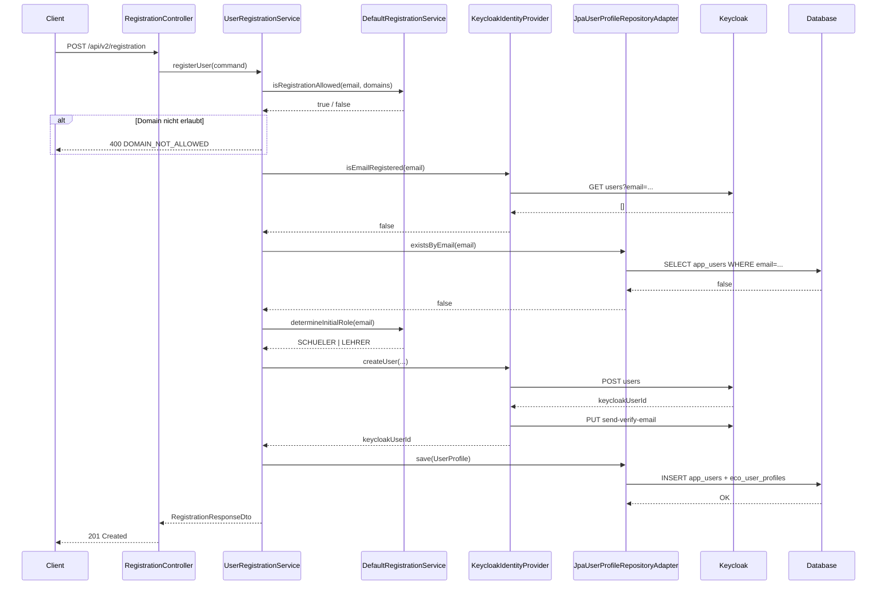

# Self-Registration – Implementierungsdokumentation

**User Story:** US-USR-02-REF  
**Modul:** `module-administration`  
**Paket:** `at.htl.ecotrack.administration.registration`  
**Status:** Implementiert ✅ | Tests: 17/17 ✅

---

## Inhaltsverzeichnis

1. [Übersicht](#1-übersicht)
2. [Architektur](#2-architektur)
3. [Klassenstruktur](#3-klassenstruktur)
4. [REST-API](#4-rest-api)
5. [Registrierungsfluss](#5-registrierungsfluss)
6. [Rollenbestimmung](#6-rollenbestimmung)
7. [Konfiguration](#7-konfiguration)
8. [Fehlerbehandlung](#8-fehlerbehandlung)
9. [Tests](#9-tests)
10. [Geänderte Bestehende Dateien](#10-geänderte-bestehende-dateien)

---

## 1. Übersicht

Die Self-Registration ermöglicht es Schüler:innen und Lehrer:innen, sich selbständig mit ihrer Schul-E-Mail-Adresse in der EcoTrack-App zu registrieren. Der Registrierungsvorgang:

- validiert die E-Mail-Domain gegen eine Whitelist (nur Schul-Domains erlaubt)
- erkennt anhand der Domain automatisch die Rolle (`SCHUELER` oder `LEHRER`)
- legt den Benutzer in Keycloak (Identity Provider) an
- versendet automatisch eine Verifikations-E-Mail
- persistiert das UserProfile lokal in der Datenbank

Die Implementierung folgt der **Hexagonalen Architektur** (Ports & Adapters) und ist vollständig von der restlichen Keycloak-Infrastruktur entkoppelt.

---

## 2. Architektur

```
module-administration
└── registration/
    ├── domain/           ← Kern-Domäne (framework-frei)
    │   ├── AllowedDomain
    │   ├── RegistrationService       (Domain-Service-Interface)
    │   ├── DefaultRegistrationService(Domain-Service-Impl)
    │   ├── IdentityProvider          (ausgehender Port)
    │   ├── UserProfile               (Aggregate Root)
    │   └── UserProfileRepository     (ausgehender Port)
    ├── application/      ← Anwendungsschicht
    │   ├── RegisterUserCommand
    │   ├── RegistrationDtos
    │   └── UserRegistrationService   (Anwendungsservice)
    ├── infrastructure/   ← Adapter (ausgehend)
    │   ├── RegistrationProperties
    │   ├── KeycloakIdentityProvider  (implementiert IdentityProvider)
    │   └── JpaUserProfileRepositoryAdapter (implementiert UserProfileRepository)
    └── api/              ← Adapter (eingehend)
        └── RegistrationController
```

### Schichtprinzip

| Schicht | Abhängigkeiten | Zweck |
|---------|---------------|-------|
| `domain` | keine | Geschäftsregeln, Entities |
| `application` | `domain` | Orchestrierung des Anwendungsfalls |
| `infrastructure` | `domain`, `application`, Spring, JPA, Keycloak | Technische Umsetzung der Ports |
| `api` | `application` | HTTP-Endpunkte |

---

## 3. Klassenstruktur

### 3.1 Domain-Schicht

#### `AllowedDomain` (Value Object)

```
registration/domain/AllowedDomain.java
```

Repräsentiert eine erlaubte Schul-E-Mail-Domain.

```java
public record AllowedDomain(String domain) {
    public boolean matches(String email) { ... }  // case-insensitive Prüfung
}
```

#### `RegistrationService` (Domain-Service-Interface / eingehender Port)

```
registration/domain/RegistrationService.java
```

Definiert die Domänenregeln der Registrierung:

| Methode | Beschreibung |
|---------|-------------|
| `isRegistrationAllowed(String email, List<AllowedDomain>)` | Prüft, ob die Domain der E-Mail in der Whitelist enthalten ist |
| `determineInitialRole(String email)` | Bestimmt die initiale Rolle anhand der E-Mail-Domain |

#### `DefaultRegistrationService` (Domain-Service-Implementierung)

```
registration/domain/DefaultRegistrationService.java
```

Konkrete Implementierung mit folgender Rollenlogik:
- E-Mail enthält `lehrer.` → Rolle `LEHRER`
- Sonst → Rolle `SCHUELER`

#### `IdentityProvider` (ausgehender Port)

```
registration/domain/IdentityProvider.java
```

Abstrahiert den externen Identity Provider (Keycloak):

| Methode | Parameter | Beschreibung |
|---------|-----------|-------------|
| `createUser` | email, password, firstName, lastName, role | Benutzer anlegen, liefert `UUID` |
| `isEmailRegistered` | email | Prüft ob E-Mail bereits im IdP vorhanden |
| `assignRole` | keycloakUserId, roleName | Rolle zuweisen |
| `sendVerificationEmail` | keycloakUserId | Verifikations-E-Mail versenden |

#### `UserProfile` (Aggregate Root)

```
registration/domain/UserProfile.java
```

Repräsentiert das lokale Benutzerprofil nach erfolgreicher Registrierung.

Factory-Methode (mit Invarianten-Prüfungen):
```java
UserProfile.create(UUID externalUserId, String email,
                   String firstName, String lastName,
                   Role role, UUID classId)
```

#### `UserProfileRepository` (ausgehender Port)

```
registration/domain/UserProfileRepository.java
```

| Methode | Beschreibung |
|---------|-------------|
| `save(UserProfile)` | Profil persistieren |
| `existsByEmail(String)` | Duplikat-Prüfung in der lokalen DB |

---

### 3.2 Anwendungsschicht

#### `RegisterUserCommand`

```
registration/application/RegisterUserCommand.java
```

Unveränderliches Command-Objekt:

```java
public record RegisterUserCommand(
    String email,
    String password,
    String firstName,
    String lastName,
    UUID classId       // optional
) {}
```

#### `RegistrationDtos`

```
registration/application/RegistrationDtos.java
```

Enthält drei statische Records:

| Record | Verwendung |
|--------|-----------|
| `RegistrationRequestDto` | Eingehende Anfrage (mit Bean Validation) |
| `RegistrationResponseDto` | Antwort bei erfolgreicher Registrierung |
| `EmailAvailabilityDto` | Antwort für den E-Mail-Verfügbarkeitscheck |

`RegistrationRequestDto` Felder und Validierungen:

| Feld | Typ | Validierung |
|------|-----|-------------|
| `email` | String | `@Email`, `@NotBlank` |
| `password` | String | `@NotBlank`, `@Size(min=8)` |
| `firstName` | String | `@NotBlank` |
| `lastName` | String | `@NotBlank` |
| `classId` | UUID | optional |

#### `UserRegistrationService` (Anwendungsservice)

```
registration/application/UserRegistrationService.java
```

Zentraler Orchestrator des Registrierungsablaufs. Koordiniert alle Domäne- und Infrastruktur-Komponenten. Details siehe [Abschnitt 5 – Registrierungsfluss](#5-registrierungsfluss).

---

### 3.3 Infrastruktur-Schicht

#### `RegistrationProperties`

```
registration/infrastructure/RegistrationProperties.java
```

Bindet die Konfiguration aus `application.yml` ein:

```java
@ConfigurationProperties(prefix = "ecotrack.registration")
public record RegistrationProperties(List<String> allowedDomains) {}
```

#### `KeycloakIdentityProvider`

```
registration/infrastructure/KeycloakIdentityProvider.java
```

Adapter der den `IdentityProvider`-Port implementiert und auf den bestehenden `KeycloakAdminService` delegiert.

| Port-Methode | Delegation |
|--------------|-----------|
| `createUser` | `keycloakAdminService.createUser(...)` |
| `isEmailRegistered` | `keycloakAdminService.getUserByEmail(email) != null` |
| `assignRole` | `keycloakAdminService.assignRole(...)` |
| `sendVerificationEmail` | `keycloakAdminService.sendVerificationEmail(UUID)` |

#### `JpaUserProfileRepositoryAdapter`

```
registration/infrastructure/JpaUserProfileRepositoryAdapter.java
```

Adapter der den `UserProfileRepository`-Port implementiert. Greift auf die bestehenden JPA-Entities `AppUser` und `EcoUserProfile` zurück – keine neuen Datenbanktabellen notwendig.

| Port-Methode | Umsetzung |
|--------------|----------|
| `save` | Legt `AppUser` via `AppUserRepository` und `EcoUserProfile` via `EcoUserProfileService` an |
| `existsByEmail` | `appUserRepository.findByEmailIgnoreCase(email).isPresent()` |

---

### 3.4 API-Schicht

#### `RegistrationController`

```
registration/api/RegistrationController.java
```

REST-Controller für die öffentlichen Registrierungsendpunkte. Delegiert vollständig an `UserRegistrationService`.

---

## 4. REST-API

Alle Endpunkte sind **öffentlich zugänglich** (kein JWT erforderlich).

### 4.1 Benutzer registrieren

```
POST /api/v2/registration
Content-Type: application/json
```

**Request-Body:**

```json
{
  "email": "max.mustermann@schueler.htl-leoben.at",
  "password": "sicheres_passwort123",
  "firstName": "Max",
  "lastName": "Mustermann",
  "classId": "550e8400-e29b-41d4-a716-446655440000"
}
```

> `classId` ist optional und kann weggelassen werden.

**Response `201 Created`:**

```json
{
  "userId": "6a9d6d72-b385-4d34-93e2-b6418960eafa",
  "email": "max.mustermann@schueler.htl-leoben.at",
  "message": "Registrierung erfolgreich. Bitte prüfe dein E-Mail-Postfach und bestätige deine Adresse."
}
```

**Fehler-Responses:**

| HTTP-Status | Fehlercode | Ursache |
|-------------|-----------|---------|
| `400 Bad Request` | `DOMAIN_NOT_ALLOWED` | E-Mail-Domain nicht in der Whitelist |
| `400 Bad Request` | `EMAIL_EXISTS` | E-Mail bereits in Keycloak oder DB vorhanden |
| `422 Unprocessable Entity` | – | Bean-Validation-Fehler (z.B. Passwort zu kurz) |

---

### 4.2 E-Mail-Verfügbarkeit prüfen

```
GET /api/v2/registration/email-check?email=max@schueler.htl-leoben.at
```

**Response `200 OK`:**

```json
{
  "email": "max@schueler.htl-leoben.at",
  "available": true
}
```

Nützlich für Echtzeit-Validierung im Frontend (z.B. während der Eingabe).

---

## 5. Registrierungsfluss

```
Mobile App / Admin-Web
        │
        │  POST /api/v2/registration
        ▼
RegistrationController
        │
        │  RegisterUserCommand
        ▼
UserRegistrationService
        │
        ├─ 1. Domain-Check ──────────────────► DefaultRegistrationService
        │                                          • isRegistrationAllowed()
        │                                          • wirft DOMAIN_NOT_ALLOWED
        │
        ├─ 2. IdP-Duplikat-Check ────────────► KeycloakIdentityProvider
        │                                          • isEmailRegistered()
        │                                          • wirft EMAIL_EXISTS
        │
        ├─ 3. DB-Duplikat-Check ─────────────► JpaUserProfileRepositoryAdapter
        │                                          • existsByEmail()
        │                                          • wirft EMAIL_EXISTS
        │
        ├─ 4. Rollenbestimmung ──────────────► DefaultRegistrationService
        │                                          • determineInitialRole()
        │                                          • LEHRER oder SCHUELER
        │
        ├─ 5. Keycloak-Benutzer anlegen ─────► KeycloakIdentityProvider
        │                                          • createUser()
        │                                          • sendVerificationEmail()
        │                                          • liefert keycloakUserId (UUID)
        │
        └─ 6. UserProfile persistieren ──────► JpaUserProfileRepositoryAdapter
                                                   • UserProfile.create()
                                                   • save() → AppUser + EcoUserProfile
```

**Sequenzdiagramm (Mermaid):**



---

## 6. Rollenbestimmung

Die Rolle wird automatisch anhand der E-Mail-Domain bestimmt – kein manueller Input nötig.

| E-Mail-Muster | Rolle |
|---------------|-------|
| `*@lehrer.htl-leoben.at` | `LEHRER` |
| `*@htl-leoben.at` | `SCHUELER` |
| `*@schueler.htl-leoben.at` | `SCHUELER` |

**Logik in `DefaultRegistrationService`:**
```java
public Role determineInitialRole(String email) {
    if (email != null && email.toLowerCase().contains("lehrer.")) {
        return Role.LEHRER;
    }
    return Role.SCHUELER;
}
```

> Erweiterte Rollenlogik (z.B. mehrere Lehrer-Domains) kann durch Anpassung dieser Methode ergänzt werden, ohne den Rest der Architektur zu ändern.

---

## 7. Konfiguration

### `application.yml`

```yaml
ecotrack:
  registration:
    allowed-domains:
      - ${REGISTRATION_DOMAIN_1:htl-leoben.at}
      - ${REGISTRATION_DOMAIN_2:schueler.htl-leoben.at}
      - ${REGISTRATION_DOMAIN_3:lehrer.htl-leoben.at}
```

Die Werte können per Umgebungsvariable überschrieben werden (z.B. für andere Schulen):

| Umgebungsvariable | Standard-Wert |
|------------------|--------------|
| `REGISTRATION_DOMAIN_1` | `htl-leoben.at` |
| `REGISTRATION_DOMAIN_2` | `schueler.htl-leoben.at` |
| `REGISTRATION_DOMAIN_3` | `lehrer.htl-leoben.at` |

Weitere Domains können durch Erweiterung der Liste in `application.yml` hinzugefügt werden, ohne Code-Änderungen vorzunehmen.

---

## 8. Fehlerbehandlung

Alle Fehler werden als `ApiException` geworfen und vom globalen `GlobalExceptionHandler` abgefangen.

| Fehlercode | HTTP-Status | Meldung | Auslöser |
|------------|-------------|---------|---------|
| `DOMAIN_NOT_ALLOWED` | 400 | "Diese E-Mail-Domain ist nicht für die Registrierung zugelassen. Bitte verwende deine Schul-E-Mail-Adresse." | E-Mail-Domain nicht in Whitelist |
| `EMAIL_EXISTS` | 400 | "Diese E-Mail-Adresse ist bereits registriert." | E-Mail in Keycloak oder lokaler DB vorhanden |

Bean-Validation-Fehler (z.B. Passwort zu kurz, ungültige E-Mail) werden automatisch mit HTTP 422 zurückgegeben.

---

## 9. Tests

### `DefaultRegistrationServiceTest`

```
module-administration/src/test/java/.../registration/domain/DefaultRegistrationServiceTest.java
```

10 Unit-Tests für die Domain-Service-Logik:

| Test | Beschreibung |
|------|-------------|
| `should_allowRegistration_when_emailMatchesAllowedDomain` | Erlaubte Domain → Registration möglich |
| `should_denyRegistration_when_emailDoesNotMatchAnyDomain` | Falsche Domain → abgelehnt |
| `should_denyRegistration_when_allowedDomainsListIsEmpty` | Leere Whitelist → abgelehnt |
| `should_denyRegistration_when_emailIsNull` | Null-E-Mail → abgelehnt |
| `should_allowRegistration_when_emailMatchesOneOfMultipleDomains` | Mehrere Domains, eine trifft zu |
| `should_allowRegistration_caseInsensitive` | Großschreibung wird ignoriert |
| `should_returnLehrer_when_emailContainsLehrerDot` | `lehrer.` in E-Mail → `LEHRER` |
| `should_returnSchueler_when_emailDoesNotContainLehrerDot` | Ohne `lehrer.` → `SCHUELER` |
| `should_returnSchueler_when_emailIsNull` | Null-E-Mail → `SCHUELER` (sicherer Fallback) |
| `should_returnSchueler_when_genericHtlEmail` | Generische HTL-E-Mail → `SCHUELER` |

### `UserRegistrationServiceTest`

```
module-administration/src/test/java/.../registration/application/UserRegistrationServiceTest.java
```

7 Unit-Tests für den Anwendungsservice (mit Mocks):

| Test | Beschreibung |
|------|-------------|
| `should_registerUser_successfully` | Vollständiger Registrierungsfluss erfolgreich |
| `should_throwException_when_emailDomainNotAllowed` | Wirft `ApiException(DOMAIN_NOT_ALLOWED)` |
| `should_throwException_when_emailAlreadyRegisteredInIdP` | Wirft `ApiException(EMAIL_EXISTS)` wenn in Keycloak vorhanden |
| `should_throwException_when_emailAlreadyExistsInLocalDb` | Wirft `ApiException(EMAIL_EXISTS)` wenn in DB vorhanden |
| `should_returnAvailable_when_emailIsNotRegisteredAnywhere` | E-Mail frei → `available: true` |
| `should_returnUnavailable_when_emailIsRegisteredInIdP` | E-Mail in Keycloak → `available: false` |
| `should_returnUnavailable_when_emailIsRegisteredInLocalDb` | E-Mail in DB → `available: false` |

**Mocking-Strategie:** Alle äußeren Abhängigkeiten (`IdentityProvider`, `UserProfileRepository`, `RegistrationService`, `RegistrationProperties`) werden per Mockito gemockt.

---

## 10. Geänderte Bestehende Dateien

### `KeycloakAdminService.java`

**Änderung:** Neue öffentliche Methode `sendVerificationEmail(UUID keycloakUserId)` hinzugefügt.

Damit kann der `KeycloakIdentityProvider`-Adapter die Verifikations-E-Mail versenden, ohne das Admin-Token selbst verwalten zu müssen.

```java
public void sendVerificationEmail(UUID keycloakUserId) {
    String token = obtainAdminToken();
    sendVerificationEmail(keycloakUserId, token);
}
```

### `SecurityConfig.java`

**Änderung:** Die neuen Endpunkte wurden zur `permitAll`-Liste hinzugefügt:

```java
// POST /api/v2/registration  →  öffentlich
.requestMatchers(HttpMethod.POST, "/api/v2/registration").permitAll()

// GET /api/v2/registration/email-check  →  öffentlich
.requestMatchers(HttpMethod.GET,  "/api/v2/registration/email-check").permitAll()
```

### `application.yml`

**Änderung:** Konfigurationsblock für erlaubte Registrierungs-Domains hinzugefügt (siehe [Abschnitt 7](#7-konfiguration)).

---

## Referenzen

- User Story: [`docs/user-stories/`](../../../docs/user-stories/)
- Bestehende Auth-Dokumentation: [`docs/KEYCLOAK_AUTH_IMPLEMENTATION.md`](KEYCLOAK_AUTH_IMPLEMENTATION.md)
- Backend-Dokumentation: [`docs/BACKEND_IMPLEMENTATION_DOCUMENTATION.md`](BACKEND_IMPLEMENTATION_DOCUMENTATION.md)
- Angabe: [`Angabe/impl-details_backend_US-USR-02-REF_self-registration.html`](../../../Angabe/impl-details_backend_US-USR-02-REF_self-registration.html)
